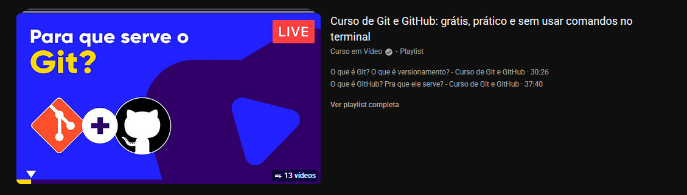

# Git Essential

## Introdução
### O que é git?
Imagine que você está jogando algum jogo e que em determinada parte se você morrer, você perde tudo que você fez até agora, isso é horrivel, certo? então você cria um <b>save</b> para que caso você morra, você possa voltar de onde parou.

O git é basicamente isso, você vai conseguir criar saves do seu codigo, para que se você fizer alguma alteração que quebre o codigo e você não consiga entender o porque, você podera voltar nos ultimos saves que você fez.

Esse save nós chamamos de `Commit`.

## Configuração Inicial

Apos instalar o git você precisa configurar e conectar com sua conta do github

```bash
git config --global user.name "Seu Nome"
git config --global user.email "seu-email@exemplo.com"
git config --list
```

## Inicializando um Repositório

Entrando na pasta que você deseja criar um um save/commit no terminal você precisa digitar esse comando

```bash
git init
```

## Controle de Versão

Agora iremos criar um commit do nosso projeto

```bash
git add .
git commit -m "Mensagem de commit"
```

`git add .` Aqui estámos dizendo que queremos que tudo que está no diretorio atual seja adicionado no commit

`git commit -m "Mensagem de commit" `
 Aqui estámos informando o titulo/comentario que vamos atrelar a esse commit


## Logs e Histórico

git log serve para vermos todos os nossos saves até agora, cada save terá um numero de identificador e o titulo que atribuímos a ele

```bash
git log
```
Escrevendo --oneline na frente do comando teremos um retorno mais simples de ler e entender

<details>
<summary>retorno de git log</summary>


</details>


```bash
git log --oneline
```
<details>
<summary>retorno de git log --oneline</summary>


</details>


Com git show podemos conferir a data e hora de um commit
```bash
git show <commit>
```

Com git diff vamos comparar as diferenças entre dois commit 
```bash
git diff
git diff <arquivo>
```


## Ramificações

O comando checkout serve para voltarmos em um commit usando seu numero de identificação

```bash
git checkout <identificador_do_commit>

ou

git checkout -b <nome-branch>
```
<details>
<summary>Onde está o identificador de cada commit</summary>


</details>


## Enviando codigo para Github

```bash
git init

git add .

git commit -m "Seu commit"

git branch -M main

git remote add origin https://github.com/seu_user/seu_repositorio

git push -u origin main
```
Essa sequencia de comandos envia seu commit para o seu repositorio no github

<br>
<br>
<br>
<br>

# Sessão de conteúdos(gratuitos) recomendados para auxiliar nos estudo:

## playlists no youtube


### Fernanda  Kipper

[Asistir o Video ](https://youtu.be/pyM5QLS2h6M?si=fQj2tZhPvqR3cOw)

### Tiago Matos

[Asistir o Playlist ](https://www.youtube.com/playlist?list=PLcoYAcR89n-qbO7YAVj5S0alABLis_QVU)

### Curso em Video - Gustavo Guanabara

[Asistir o Playlist ](https://www.youtube.com/playlist?list=PLHz_AreHm4dm7ZULPAmadvNhH6vk9oNZA)

<hr>

# Sites para treinar

## Git Branching
Ajuda a visualizar os comandos git e seu funcionamento


[ Acessar site ](https://learngitbranching.js.org/)


<hr>


## Git docs
A propria documentação do git


[ Acessar site ](https://git-scm.com/book/pt-br/v2/Come%C3%A7ando-O-B%C3%A1sico-do-Git)


<br>
<br>
<br>
Autor: Kayque Othon

- [Visite meu Linkedin](https://www.linkedin.com/in/kayque-othon/)

- [Visite meu GitHub](https://github.com/othonkayque)
